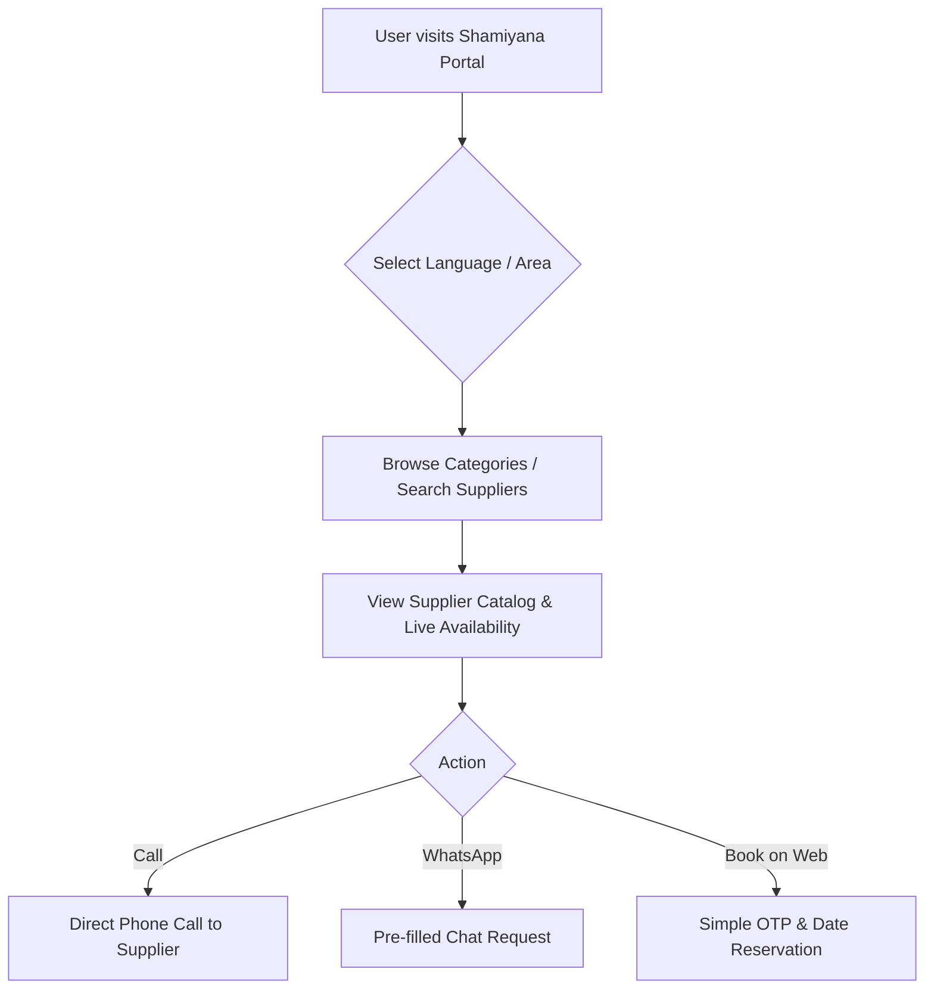

# Shamiyana MVP Platform: Detailed Implementation & Strategy Plan

This document outlines the expanded MVP (Minimum Viable Product) plan for a **Shamiyana Supplier-Consumer Platform**. It is designed to be highly accessible to the average person in **Hubli, Karnataka, India**, ensuring that users with basic digital literacy can immediately understand the platform, browse stock, check availability, and place a booking.

---

## 1. Hubli-Centric Localization & UX Strategy

To ensure the platform is intuitive for the local Hubli demographic:
*   **Vibrant, Festive Color Palette:** Traditional Indian festive colors—**Marigold Yellow** (`#FFB300`), **Deep Vermillion/Red** (`#C62828`), and a **WhatsApp Green** (`#25D366`) for communication.
*   **Dual-Language Mode (Kannada & English):** A simple toggle at the top of the screen. Items will be displayed with local names (e.g., *Chairs / ಕುರ್ಚಿಗಳು*, *Plates / ಊಟದ ತಟ್ಟೆಗಳು*, *Spatula / ಸೌಟು*).
*   **Visual-First Catalog:** Large, authentic photos of items (avoid vector icons). Users need to see exactly what style of steel plate, plastic tea cup, or decorative stage they are renting.
*   **Frictionless Contact (WhatsApp & Call):** Most local bookings in North Karnataka happen via phone call or WhatsApp. Prominent, floating green WhatsApp and phone icons are critical.
*   **Hubli Area Filter:** Pre-defined selection of areas (e.g., *Gokul Road, Keshwapur, Vidyanagar, Shirur Park, Rajnagar, Unkal*).
*   **Progressive Web App (PWA):** Instead of forcing a Play Store download, the site will prompt users to "Add to Home Screen", functioning like a native app without the storage overhead.

---

## 2. Platform Revenue & Monetization Model

To ensure the platform is sustainable while minimizing friction during the MVP launch:
*   **Phase 1 (MVP - Free Tier):** Completely free for both suppliers and consumers to build the user base and directory density.
*   **Phase 2 (Monetization):**
    *   **Promoted Listings:** Suppliers pay a small weekly/monthly fee (e.g., ₹299/month) to appear at the top of search results in their area.
    *   **Verified Supplier Badge:** A one-time verification fee (e.g., ₹500) where the platform verifies their physical stock and provides a "Trusted Supplier" badge.
    *   **Lead Generation Fee:** For direct web bookings, a nominal flat convenience fee (e.g., ₹50) is charged, whereas WhatsApp/Direct calls remain free to encourage usage.

---

## 3. Core User Workflows



### A. Consumer (Organizer/Host) Flow
1.  **Landing Page:** Big, clear banner: *"Rent Shamiyana, Chairs, Plates & Stage Items for Your Function"* / *"ನಿಮ್ಮ ಮನೆ ಶುಭಕಾರ್ಯಗಳಿಗೆ ಶಾಮಿಯಾನ, ಕುರ್ಚಿ, ಪಾತ್ರೆಗಳು ಬಾಡಿಗೆಗೆ ಪಡೆಯಿರಿ"*.
2.  **Browse Inventory:** Filter by categories: 
    *   *Shamiyana & Stage (ಶಾಮಿಯಾನ ಮತ್ತು ಸ್ಟೇಜ್)*
    *   *Tables & Chairs (ಮೇಜು ಮತ್ತು ಕುರ್ಚಿಗಳು)*
    *   *Kitchen Utensils (ಅಡುಗೆ ಪಾತ್ರೆ ಮತ್ತು ತಟ್ಟೆಗಳು)*
3.  **Supplier Detail Page:**
    *   See live stock (e.g., *"500 Steel Plates available"*).
    *   Availability Calendar (check if booked on a specific date).
    *   Supplier ratings and reviews (Social Proof).
4.  **Booking/Contacting:**
    *   **Call Button** (Instant phone dial).
    *   **WhatsApp Chat** (Pre-filled message: *"Hi, I saw your listing on Shamiyana Portal. I want 200 chairs on [Date]. Is it available?"*).

### B. Supplier (Dhanda Owner) Flow
1.  **Simple Login:** Mobile number + OTP (No email/password required).
2.  **Manage Stock (Inventory):** Edit quantities and rental prices per day (e.g., *Steel Plate: ₹3/day*, *Plastic Chair: ₹5/day*).
3.  **Calendar Blockout:** Mark specific dates as "Fully Booked" (e.g., during major wedding muhurtams).
4.  **Enquiry Dashboard:** View incoming booking requests, customer details, and update status.

---

## 4. Technical Stack & Architecture

A lightweight, highly responsive stack to ensure the app loads quickly on 4G mobile networks.

*   **Frontend / UI:** 
    *   **Next.js (App Router):** For SSR (Server-Side Rendering) to ensure suppliers rank locally on Google Search.
    *   **Tailwind CSS:** For rapid, mobile-first styling.
    *   **Lucide React:** For clean, recognizable icons (Phone, Map Pin, Calendar).
    *   **Date-fns / React-Day-Picker:** For lightweight calendar and availability management.
*   **Backend & Database:** 
    *   **Supabase (PostgreSQL):** Provides instant REST APIs, row-level security (RLS), and built-in mobile OTP authentication.
*   **Hosting & Deployment:** 
    *   **Vercel** for the Next.js frontend.
*   **Maps & Geolocation:** 
    *   **Leaflet.js** (OpenStreetMap) to avoid high Google Maps API costs during MVP.

---

## 5. Database Schema (Supabase)

```mermaid
erDiagram
    SUPPLIERS ||--o{ INVENTORY : "manages"
    SUPPLIERS ||--o{ BOOKINGS : "receives"
    SUPPLIERS ||--o{ REVIEWS : "receives"
    INVENTORY ||--o{ BOOKING_ITEMS : "included_in"
    BOOKINGS ||--o{ BOOKING_ITEMS : "contains"

    SUPPLIERS {
        uuid id PK
        string business_name
        string phone_number UNIQUE
        string area_name "e.g., Gokul Road"
        decimal latitude
        decimal longitude
        boolean is_verified
        decimal average_rating
    }

    REVIEWS {
        uuid id PK
        uuid supplier_id FK
        string customer_name
        integer rating "1 to 5"
        text comment
        timestamp created_at
    }

    INVENTORY {
        uuid id PK
        uuid supplier_id FK
        string item_name_en "e.g., Steel Meal Plate"
        string item_name_kn "e.g., ಸ್ಟೀಲ್ ಊಟದ ತಟ್ಟೆ"
        string category
        integer total_stock
        decimal price_per_day
        string image_url
    }

    BOOKINGS {
        uuid id PK
        uuid supplier_id FK
        string customer_name
        string customer_phone
        date event_date
        string status "pending, confirmed, cancelled"
        decimal total_price
    }

    BOOKING_ITEMS {
        uuid id PK
        uuid booking_id FK
        uuid inventory_id FK
        integer quantity
    }
```

---

## 6. Actionable Implementation Milestones

### **Phase 1: Foundation & Brand Identity (Weeks 1-2)**
*   Initialize Next.js project with Tailwind CSS.
*   Set up Supabase schema (`suppliers`, `inventory`, `bookings`, `reviews`).
*   Establish translation dictionary for English/Kannada keys.

### **Phase 2: Supplier Directory & Browsing (Weeks 2-3)**
*   Implement Consumer landing page with search filters (Area, Date).
*   Develop Supplier Profile view displaying catalog items, daily price tags, and available stock.
*   Configure the "Call Now" and "WhatsApp Chat" integrations using dynamic `wa.me` links.

### **Phase 3: Booking Engine & Calendars (Weeks 3-4)**
*   Build an interactive date picker for consumers that validates against supplier stock availability.
*   Develop a simplified booking cart where customers can select item quantities (e.g., 200 chairs, 5 tables) and submit via OTP verification.

### **Phase 4: Supplier Admin Portal & Testing (Weeks 4-5)**
*   Create the Supabase Mobile OTP login flow for suppliers.
*   Add a secure dashboard for suppliers to increase/decrease item quantities and accept bookings.
*   Conduct field testing on diverse Android devices in Hubli to ensure UI responsiveness and high-contrast readability.

---

## 7. Post-MVP Roadmap (V2)

Once product-market fit is established:
1.  **Online Payments:** Integrate Razorpay or PhonePe PG for partial advance payments to secure bookings.
2.  **Delivery & Logistics Integration:** Allow suppliers to specify delivery fees based on km distance (using geofencing) or integrate local tempo/mini-truck services.
3.  **AI Image Moderation:** Automatically verify that supplier uploaded photos are actual equipment and not generic internet stock photos.
